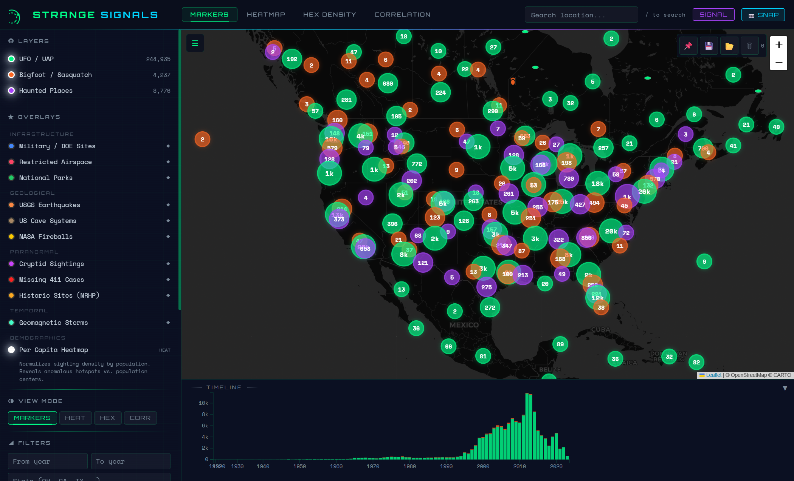
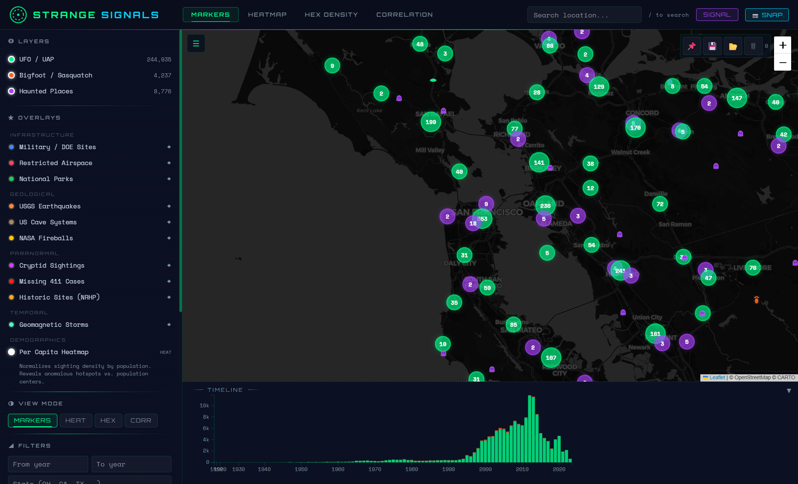
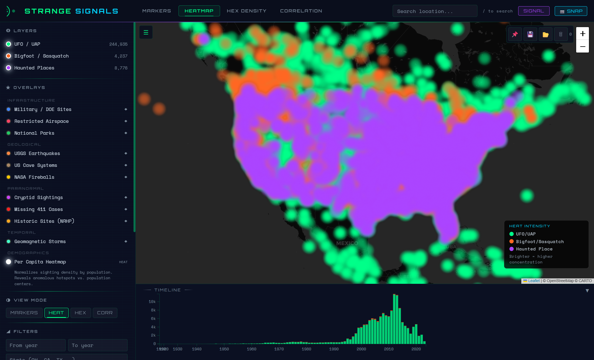
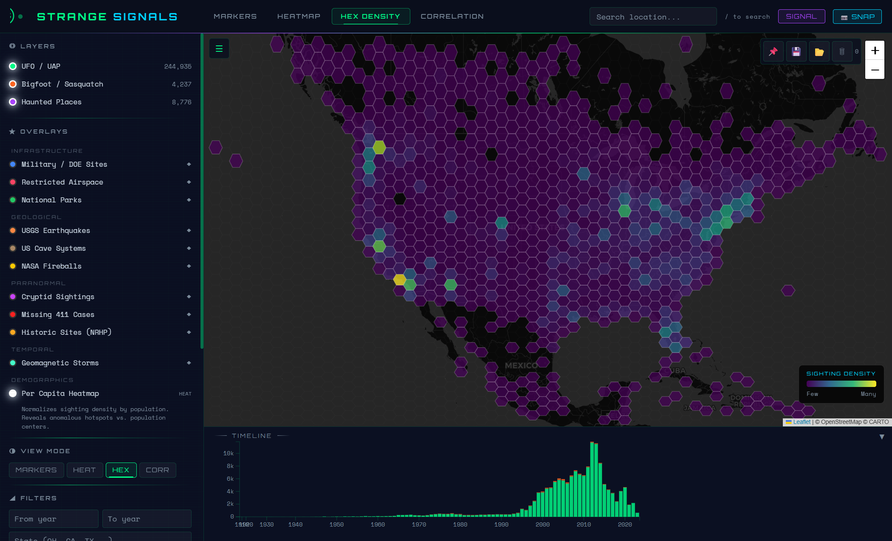
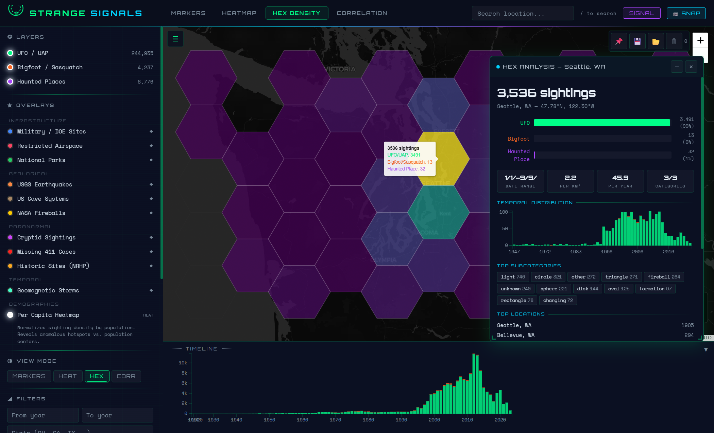
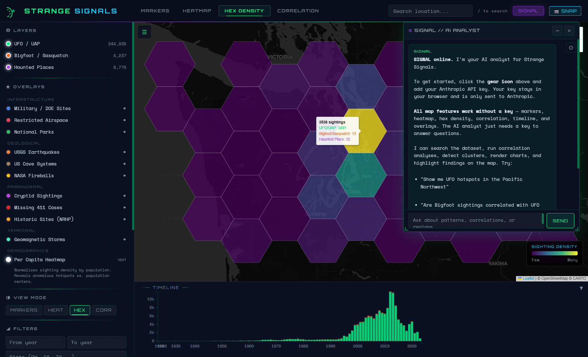
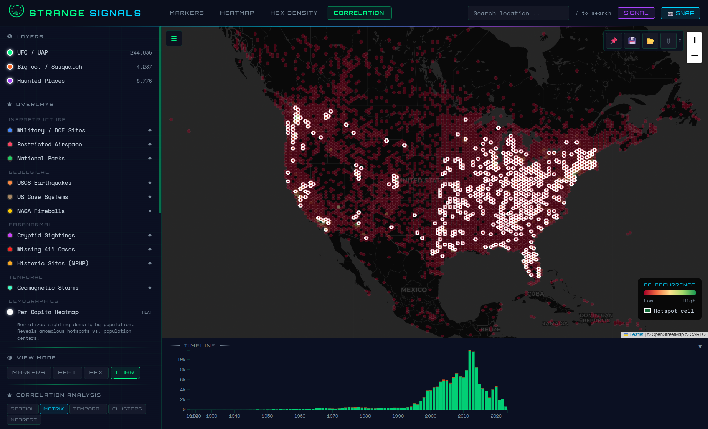
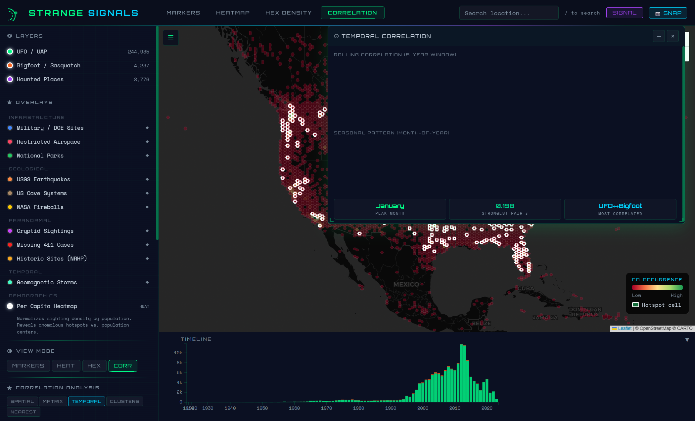
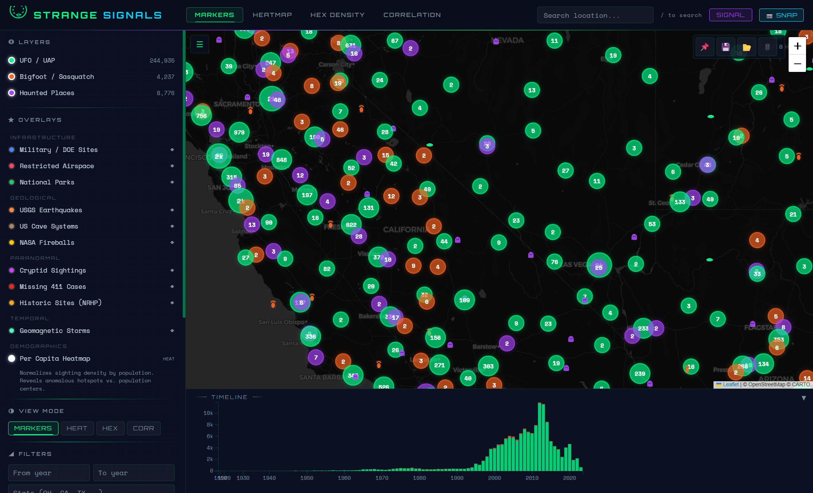

<p align="center">
  
</p>

<h1 align="center">STRANGE SIGNALS</h1>

<p align="center">
  <strong>Interactive Paranormal Sightings Correlation Map</strong><br>
  258,000+ geocoded reports across UFO/UAP, Bigfoot, and Haunted Places — with spatial correlation analysis, 10+ overlay datasets, and an AI research assistant.
</p>

<p align="center">
  <a href="#features">Features</a> &bull;
  <a href="#screenshots">Screenshots</a> &bull;
  <a href="#getting-started">Getting Started</a> &bull;
  <a href="#data-sources">Data Sources</a> &bull;
  <a href="#architecture">Architecture</a> &bull;
  <a href="#signal-ai">SIGNAL AI</a> &bull;
  <a href="#license">License</a>
</p>

---

## What is Strange Signals?

Strange Signals is an interactive web-based map that visualizes and correlates 258,000+ paranormal sighting reports across the United States. It combines three categories of unexplained phenomena — UFO/UAP sightings, Bigfoot/Sasquatch encounters, and Haunted Places — and layers them with real-world data like military installations, restricted airspace, earthquake zones, cave systems, and more.

The goal: **discover spatial and temporal patterns** hidden in the data. Do UFO sightings cluster near military bases? Do Bigfoot reports correlate with cave systems? Are paranormal hotspots near geomagnetically active zones? Strange Signals gives you the tools to explore these questions.

## Features

### Four Visualization Modes

| Mode | Description |
|------|-------------|
| **Markers** | Clustered marker view with color-coded pins. Click any cluster to drill down, click a sighting for full details with proximity analysis |
| **Heatmap** | Density heatmap with per-category color blending. Instantly see where reports concentrate |
| **Hex Density** | Hexagonal binning with viridis color scale. Click any hex for deep analysis — category breakdown, temporal distribution, top subcategories, density stats |
| **Correlation** | Five analysis sub-modes: Spatial correlation, Correlation matrix, Temporal patterns, Cluster detection, and Nearest-neighbor distances |

### Overlay Datasets

Toggle 10+ real-world reference layers to investigate correlations:

| Category | Overlays |
|----------|----------|
| **Infrastructure** | Military/DOE Sites, Restricted Airspace (MOAs, prohibited zones), National Parks |
| **Geological** | USGS Earthquakes (20K events), US Cave Systems, NASA Fireballs |
| **Paranormal** | Cryptid Sightings, Missing 411 Cases, Historic Sites (NRHP) |
| **Temporal** | Geomagnetic Storms (solar activity bands on timeline) |
| **Demographics** | Per Capita Heatmap (population-normalized sighting density) |

### Correlation Analysis Suite

- **Spatial Correlation** — Pearson correlation between any two categories or overlays using hex-binned co-occurrence. Correlate UFO sightings against Restricted Airspace, Bigfoot against Cave Systems, or any combination
- **Correlation Matrix** — 3x3 heatmap showing all pairwise correlations at a glance with statistical significance markers
- **Temporal Correlation** — Rolling 5-year correlation window and seasonal pattern analysis with peak month identification
- **Cluster Detection** — BFS-based spatial clustering that identifies statistically significant hotspot regions
- **Nearest-Neighbor** — Grid-indexed distance analysis between categories

### SIGNAL AI Assistant

Built-in AI research assistant powered by Claude. SIGNAL can:
- Search and filter the dataset by location, date, category, or description
- Run spatial correlations and explain the results
- Detect clusters and highlight them on the map
- Toggle overlay layers and analyze nearby features
- Generate downloadable HTML investigation reports
- Navigate the map to areas of interest

### Additional Features

- **Timeline** — Interactive D3 stacked bar chart with brush selection for temporal filtering
- **Filters** — Year range, state, subcategory/shape text filtering with live updates
- **URL State** — Every view, zoom level, filter, and layer toggle is preserved in the URL hash for shareable links
- **CSV Export** — Export visible filtered data as CSV
- **Keyboard Shortcuts** — Full keyboard navigation (press `?` for all shortcuts)
- **Annotations** — Pin notes anywhere on the map, export/import as JSON
- **Snapshot** — One-click screenshot export of the current map view

## Screenshots

### Marker Clusters — Zoomed to California/Nevada


### Heatmap — National Sighting Density


### Hex Density — Zoomed to Pacific Northwest


### Hex Detail Panel — Deep Analysis


Click any hex cell to open a detailed analysis panel showing:
- Total sighting count with per-category breakdown
- Density per km² and per year statistics
- Temporal distribution chart
- Top subcategories (light, circle, triangle, fireball, etc.)
- Top reported locations within the hex

### SIGNAL AI Assistant


### Correlation Matrix


### Temporal Correlation Dashboard


### Overlay Layers — Military & Airspace


## Getting Started

### Prerequisites

- Python 3.8+ (for the data pipeline)
- A modern web browser
- (Optional) An [Anthropic API key](https://console.anthropic.com/) for SIGNAL AI

### Quick Start

```bash
# Clone the repo
git clone https://github.com/Samizdat-Publications/strange-signals.git
cd strange-signals

# Install Python dependencies
pip install -r requirements.txt

# Run the data pipeline (downloads datasets, builds JSON)
bash setup_sightings.sh

# Start the dev server
python -m http.server 8001

# Open http://localhost:8001 in your browser
```

### SIGNAL AI Setup

All map features work without an API key. To enable the AI assistant:

1. Click the **SIGNAL** button in the top-right
2. Click the gear icon in the SIGNAL panel
3. Enter your Anthropic API key
4. Your key stays in your browser's localStorage — it is never sent anywhere except directly to Anthropic's API

## Data Sources

### Sighting Datasets (258K+ records)

| Dataset | Records | Source |
|---------|---------|--------|
| UFO/UAP (NUFORC via TidyTuesday) | ~96K | [TidyTuesday 2023](https://github.com/rfordatascience/tidytuesday/tree/master/data/2023/2023-06-20) |
| UFO/UAP (planetsig geocoded) | ~80K | [planetsig/ufo-reports](https://github.com/planetsig/ufo-reports) |
| Bigfoot (BFRO detailed) | ~5K | [TidyTuesday 2022](https://github.com/rfordatascience/tidytuesday/tree/master/data/2022/2022-09-13) |
| Bigfoot (BFRO locations) | ~4.2K | [Christopher1994-1/bigfoot-dataset-website](https://github.com/Christopher1994-1/bigfoot-dataset-website) |
| Haunted Places (Shadowlands) | ~11K | [TidyTuesday 2023](https://github.com/rfordatascience/tidytuesday/tree/master/data/2023/2023-10-10) |

### Overlay Datasets

| Dataset | Records | Description |
|---------|---------|-------------|
| Military / DOE Sites | 45 | Major military installations and DOE facilities |
| Restricted Airspace | 105 | MOAs, prohibited zones, restricted areas with altitude data |
| USGS Earthquakes | 20K | Significant US earthquakes with magnitude and depth |
| US Cave Systems | 104 | Notable cave systems with type and length |
| NASA Fireballs | 29 | Confirmed fireball/bolide events with energy and velocity |
| Cryptid Sightings | 105 | Non-Bigfoot cryptid reports (Mothman, Chupacabra, etc.) |
| Missing 411 | 71 | Unexplained disappearances in wilderness areas |
| Geomagnetic Storms | 92 | G3+ geomagnetic storms (temporal overlay on timeline) |

## Architecture

Strange Signals is a **zero-build static web app** — no webpack, no npm, no bundlers. Just HTML, CSS, and JavaScript served from a simple HTTP server.

### Tech Stack

| Technology | Version | Purpose |
|------------|---------|---------|
| [Leaflet](https://leafletjs.com/) | 1.9.4 | Map rendering, markers, popups |
| [Leaflet MarkerCluster](https://github.com/Leaflet/Leaflet.markercluster) | 1.5.3 | Dynamic cluster visualization |
| [leaflet-heat](https://github.com/Leaflet/Leaflet.heat) | 0.2.0 | Heatmap overlay |
| [Turf.js](https://turfjs.org/) | 7 | Geospatial analysis (hex grid, point-in-polygon, distances) |
| [D3.js](https://d3js.org/) | 7 | Timeline, correlation charts, SVG rendering |
| [CARTO Dark Matter](https://carto.com/basemaps/) | — | Dark map tiles |

### File Structure

```
index.html                 HTML shell — structure, CDN refs, links CSS/JS
strange-signals.css        All styles — CSS custom properties, layout, responsive
strange-signals.js         Main app logic (~2800 lines) — IIFE-wrapped
ai-assistant.js            SIGNAL AI assistant — tool-use Claude integration
signal-reports.js          Report generation and HTML export
signal-charts.js           SVG chart rendering for reports

data/
  sightings_map_data.json  Main dataset (generated, git-ignored)
  military_bases.json      Military/DOE installations
  restricted_airspace.json Restricted airspace zones
  usgs_earthquakes.json    USGS earthquake data
  us_caves.json            US cave systems
  nasa_fireballs.json      NASA fireball events
  cryptid_sightings.json   Non-Bigfoot cryptid reports
  missing411.json          Missing 411 cases
  geomagnetic_storms.json  Solar storm temporal data
  us_population_density.json  Population density grid
  national_parks.json      National park boundaries

setup_sightings.sh              Download raw datasets
build_sightings_workbook.py     Consolidate CSVs to Excel
export_map_data.py              Excel to compact JSON
build_overlay_data.py           Generate overlay datasets
build_population_grid.py        Population density grid
```

### Data Format

Sighting records use a compact array format (not objects) to minimize JSON size:

```json
{
  "categories": ["UFO/UAP", "Bigfoot/Sasquatch", "Haunted Place"],
  "fields": ["lat", "lon", "cat", "date", "location", "subcategory", "description"],
  "data": [[39.12, -84.56, 0, "2020-01-15", "Cincinnati, OH", "triangle", "Bright light..."]]
}
```

## SIGNAL AI

SIGNAL is an AI research assistant built directly into Strange Signals. It uses Claude's tool-use capability to interact with the map programmatically.

### Available Tools

| Tool | Description |
|------|-------------|
| `search_sightings` | Search by location, date range, category, or description keywords |
| `get_area_stats` | Statistical summary for the current map viewport |
| `run_spatial_correlation` | Pearson correlation between any two categories or overlays |
| `detect_clusters` | BFS-based hotspot detection with configurable thresholds |
| `filter_data` | Apply year, state, or subcategory filters |
| `navigate_map` | Pan/zoom to specific locations or coordinates |
| `toggle_overlay` | Enable/disable overlay layers |
| `get_nearby_overlays` | Find overlay features within a radius of a point |
| `generate_report` | Create downloadable HTML investigation reports |
| `render_chart` | Generate SVG charts (bar, line, scatter) in the chat |

### Example Prompts

- *"Show me UFO hotspots in the Pacific Northwest"*
- *"Are Bigfoot sightings correlated with cave systems?"*
- *"What happened near Area 51 between 2010 and 2020?"*
- *"Run a full correlation analysis and generate a report"*
- *"Compare sighting density near military bases vs. elsewhere"*

## Keyboard Shortcuts

| Key | Action |
|-----|--------|
| `1` `2` `3` | Toggle UFO / Bigfoot / Haunted layers |
| `M` `H` `X` `C` | Switch view mode (Markers/Heat/Hex/Correlation) |
| `I` | Open SIGNAL AI assistant |
| `S` | Toggle sidebar |
| `T` | Toggle timeline |
| `/` | Focus search bar |
| `?` | Show all shortcuts |

## Contributing

Contributions are welcome! See [CONTRIBUTING.md](CONTRIBUTING.md) for guidelines.

### Areas for Contribution

- Additional overlay datasets (seismic fault lines, ley lines, water sources)
- International sighting data (currently US-only)
- Mobile-optimized layout improvements
- Additional correlation analysis methods
- Data pipeline improvements

## License

This project is licensed under the MIT License — see [LICENSE](LICENSE) for details.

## Acknowledgments

- [NUFORC](https://nuforc.org/) — National UFO Reporting Center for decades of sighting data
- [BFRO](https://www.bfro.net/) — Bigfoot Field Researchers Organization
- [TidyTuesday](https://github.com/rfordatascience/tidytuesday) — For curating and sharing datasets
- [Shadowlands Haunted Places](http://www.theshadowlands.net/) — Haunted location database
- [USGS](https://earthquake.usgs.gov/) — Earthquake data
- [NASA CNEOS](https://cneos.jpl.nasa.gov/) — Fireball and bolide data
- [Anthropic](https://anthropic.com/) — Claude AI powering SIGNAL

---

<p align="center">
  <em>Built with curiosity. Explore the unknown.</em>
</p>
