<p align="center">
  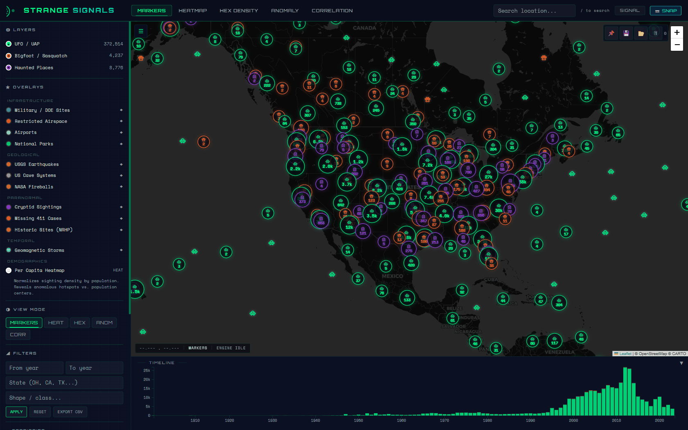
</p>

<h1 align="center">STRANGE SIGNALS</h1>

<p align="center">
  <strong>Interactive Paranormal Sightings Correlation Map</strong><br>
  385,531 geocoded reports across UFO/UAP, Bigfoot, and Haunted Places — spanning 593 BC to the present, worldwide — with population-corrected anomaly detection, 12 overlay datasets, and an AI research assistant.
</p>

<p align="center">
  <a href="#features">Features</a> &bull;
  <a href="#screenshots">Screenshots</a> &bull;
  <a href="#getting-started">Getting Started</a> &bull;
  <a href="#data-sources">Data Sources</a> &bull;
  <a href="#architecture">Architecture</a> &bull;
  <a href="#signal-ai">SIGNAL AI</a> &bull;
  <a href="#license">License</a>
</p>

---

## What is Strange Signals?

Strange Signals is an interactive web-based map that visualizes and correlates 385,531 paranormal sighting reports, worldwide, from 593 BC to the present. It combines three categories of unexplained phenomena — UFO/UAP sightings, Bigfoot/Sasquatch encounters, and Haunted Places — and layers them with real-world data like military installations, restricted airspace, earthquake zones, cave systems, and more.

The goal: **discover spatial and temporal patterns** hidden in the data. Do UFO sightings cluster near military bases? Do Bigfoot reports correlate with cave systems? Are paranormal hotspots near geomagnetically active zones? Strange Signals gives you the tools to explore these questions.

## Features

### The Signal Engine (v2)

Raw sighting counts mostly tell you where people live. The **Signal Engine** models
*expected* counts per hex cell from census population, calibrates for regional reporting
culture, and flags only cells that statistically exceed that baseline (Poisson test,
Benjamini–Hochberg FDR q&lt;0.05, rate ratio ≥1.5, Getis-Ord Gi* spatial coherence).
The result is a map of **where there is more than there should be** — Sedona, Mt. Shasta,
and the Puget Sound corridor light up; mere big cities don't.

- **ANOMALY view** — the flagship visualization. Significant cells glow green→amber by
  Anomaly Index; significant deficits show blue; everything else stays dark
- **DEEP DIVE dossiers** — right-click anywhere on the map for a full regional workup:
  anomaly verdict, per-category rate ratios, historical **flap episode detection**,
  seasonality vs the national pattern, overlay context, a confounder ledger, and
  exemplar cases — exportable as a standalone HTML report
- **Honest correlations** — every spatial correlation now reports raw *r* alongside
  population-adjusted *r*, so "ghosts correlate with UFOs" can't hide "cities exist"

### Five Visualization Modes

| Mode | Description |
|------|-------------|
| **Markers** | Clustered instrument-blip view with color-coded pins. Click any cluster to drill down, click a sighting for full details with proximity analysis |
| **Heatmap** | Density heatmap with per-category color blending. Instantly see where reports concentrate |
| **Hex Density** | Hexagonal binning with viridis color scale. Click any hex for deep analysis — category breakdown, temporal distribution, top subcategories, density stats |
| **Anomaly** | Signal Engine output — population/reporting-corrected statistical excess, FDR-controlled. Click any cell for the full anomaly breakdown |
| **Correlation** | Five analysis sub-modes: Spatial correlation (population-partialed), Correlation matrix, Temporal patterns, Cluster detection, and Nearest-neighbor distances |

### Overlay Datasets

Toggle 12 real-world reference layers to investigate correlations:

| Category | Overlays |
|----------|----------|
| **Infrastructure** | Military/DOE Sites, Restricted Airspace (MOAs, prohibited zones), Airports (876 US hubs — the #1 UAP confounder), National Parks |
| **Geological** | USGS Earthquakes (20K events), US Cave Systems, NASA Fireballs |
| **Paranormal** | Cryptid Sightings, Missing 411 Cases, Historic Sites (NRHP) |
| **Temporal** | Geomagnetic Storms (solar activity bands on timeline) |
| **Demographics** | Per Capita Heatmap (population-normalized sighting density) |

### Correlation Analysis Suite

- **Spatial Correlation** — Pearson correlation between any two categories or overlays using hex-binned co-occurrence. Correlate UFO sightings against Restricted Airspace, Bigfoot against Cave Systems, or any combination
- **Correlation Matrix** — 3x3 heatmap showing all pairwise correlations at a glance with statistical significance markers
- **Temporal Correlation** — Rolling 5-year correlation window and seasonal pattern analysis with peak month identification
- **Cluster Detection** — BFS-based spatial clustering that identifies statistically significant hotspot regions
- **Nearest-Neighbor** — Grid-indexed distance analysis between categories

### SIGNAL AI Assistant

Built-in AI research assistant powered by Claude. SIGNAL can:
- Hunt anomalies with the Signal Engine (`get_anomaly_scores`) and run full
  deep-dive dossiers on any location (`run_deep_dive`)
- Detect historical flap episodes (space-time bursts) automatically
- **Capture map evidence** — screenshot the staged map mid-investigation and embed
  the captures in illustrated, downloadable HTML reports
- Search and filter the dataset by location, date, category, or description
- Run population-adjusted spatial correlations and explain the results honestly
- Toggle overlay layers, analyze nearby features, place annotation pins
- Every tool call appears in a live **investigation log** with arguments and timing

### Additional Features

- **Timeline** — Interactive D3 stacked bar chart with brush selection for temporal filtering
- **Filters** — Year range, state, subcategory/shape text filtering with live updates
- **URL State** — Every view, zoom level, filter, and layer toggle is preserved in the URL hash for shareable links
- **CSV Export** — Export visible filtered data as CSV
- **Keyboard Shortcuts** — Full keyboard navigation (press `?` for all shortcuts)
- **Annotations** — Pin notes anywhere on the map, export/import as JSON
- **Snapshot** — One-click screenshot export of the current map view

## Screenshots

### ANOMALY — where there is more than there should be
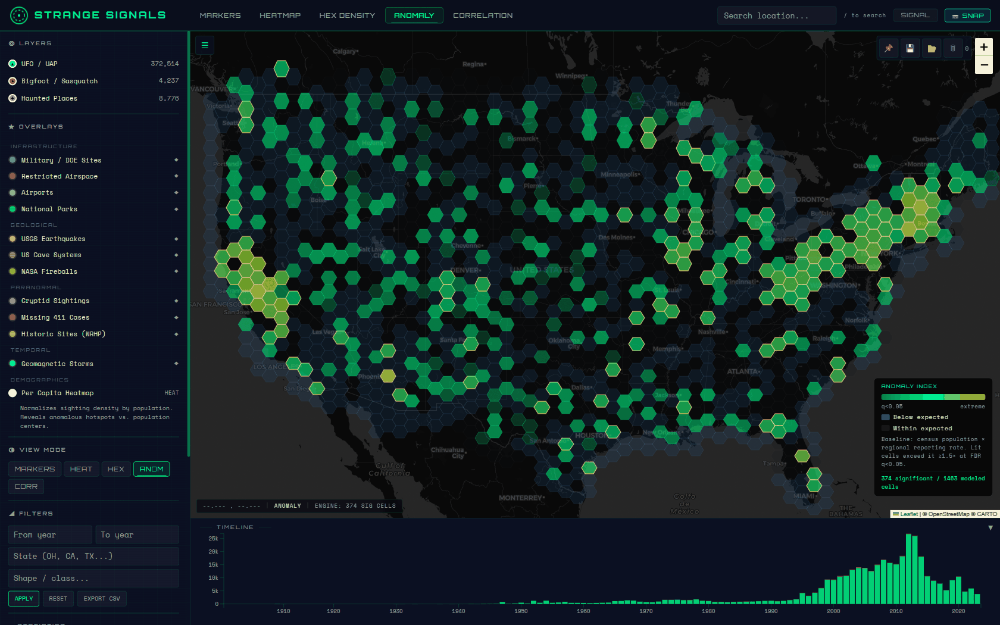

The flagship view. Every lit cell has survived a Poisson test against a baseline built from
census population and regional reporting rate, then Benjamini&ndash;Hochberg FDR correction at
q&lt;0.05 with a rate ratio of at least 1.5&times;. **374 significant cells out of 1,463 modeled.**
Blue cells are significant *deficits* &mdash; fewer reports than the baseline predicts. Big cities
alone do not light up; that is the entire point.

### DEEP DIVE — a full regional workup on any point
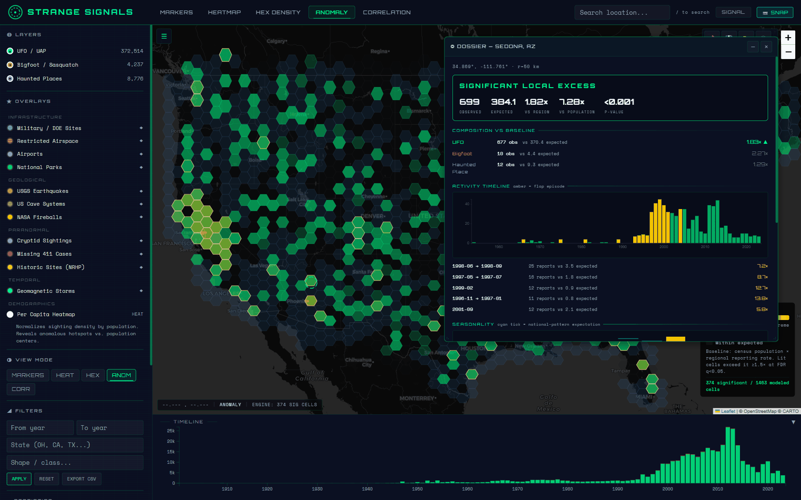

Right-click anywhere for a dossier. Sedona, AZ &mdash; 699 observed against 384.1 expected,
**7.28&times; its population baseline**, p&lt;0.001:

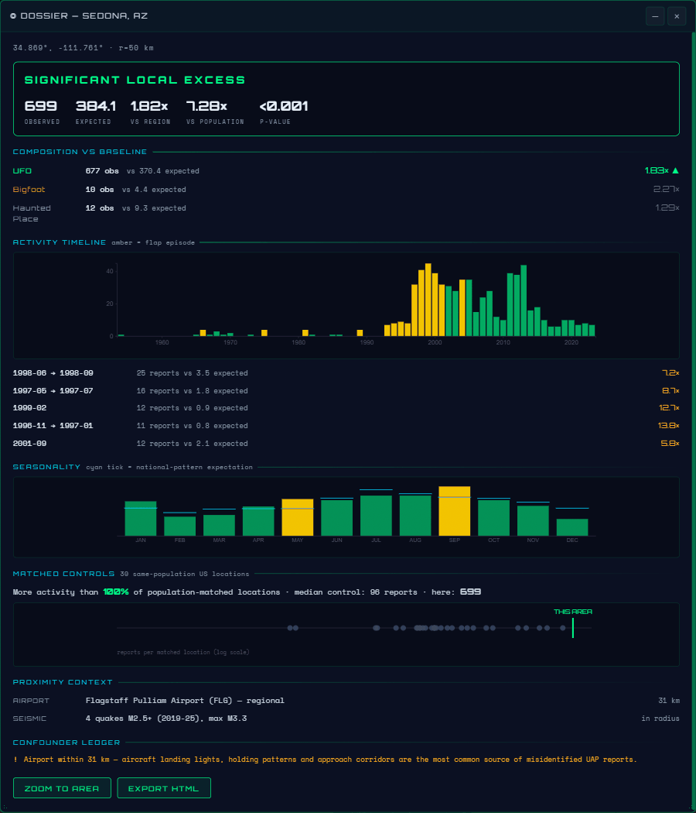

Note the bottom two panels. **Matched controls** benchmarks the area against 30
same-population US locations &mdash; Sedona beats 100% of its population twins, median control 96
reports versus 699 here. The **confounder ledger** then argues against itself, flagging
Flagstaff Pulliam Airport 31 km away because aircraft landing lights are the single most
common source of misidentified UAP reports.

### Hex Analysis — including the honest answer
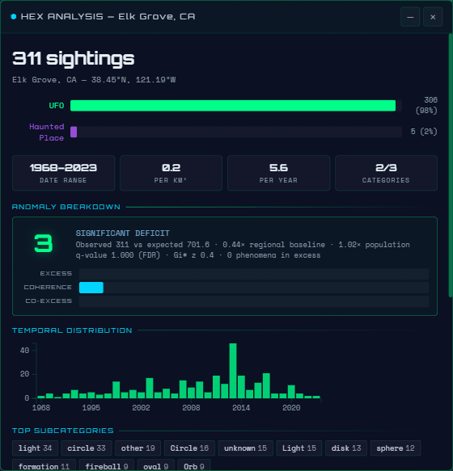

Click any cell for a breakdown. This one is a **significant deficit** &mdash; Elk Grove, CA has
311 sightings, which sounds like a lot until you see it is 0.44&times; its regional baseline. A tool
that only ever finds excess is not measuring anything.

### Marker Clusters — Zoomed to the Bay Area
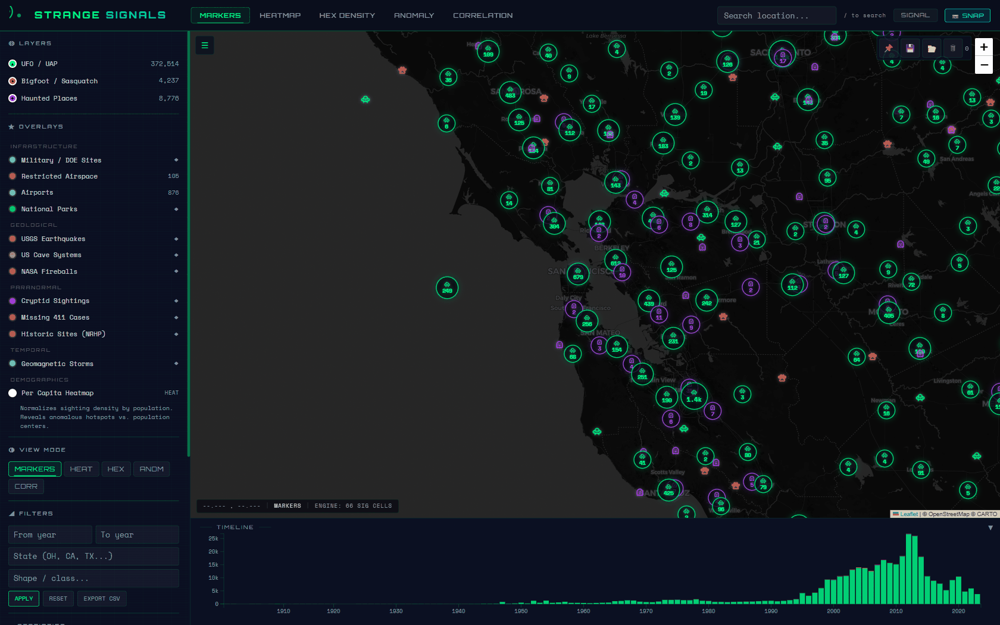

### Heatmap — National Sighting Density
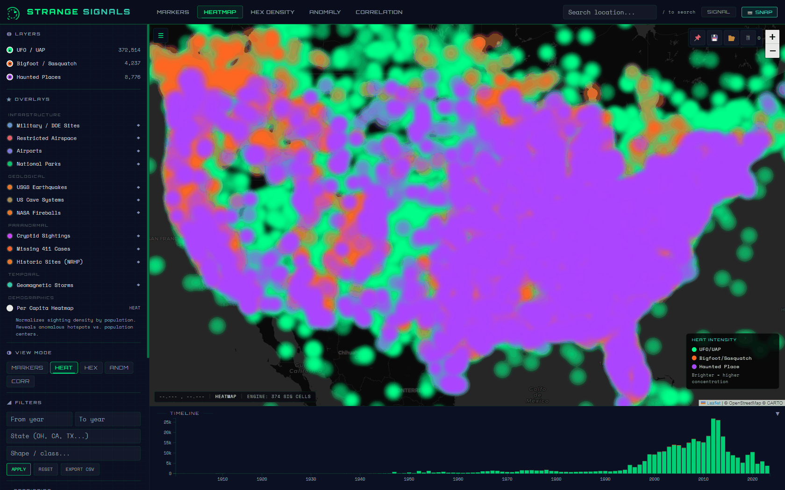

### Hex Density — Pacific Northwest
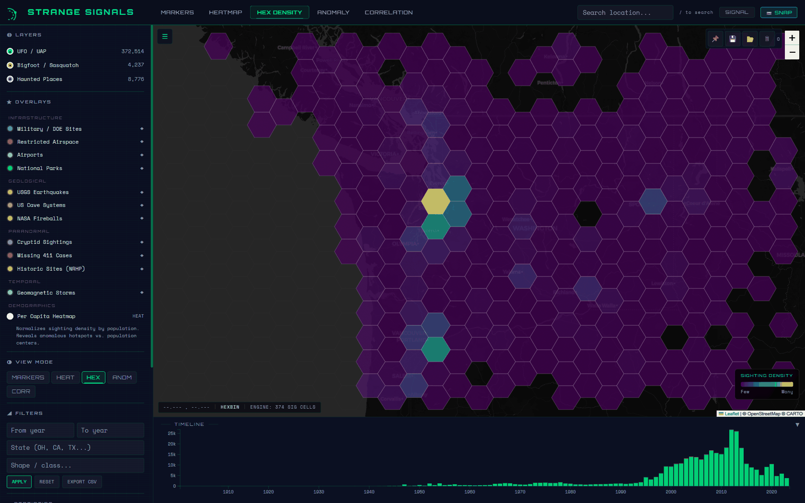

### Overlays — Sightings against Restricted Airspace
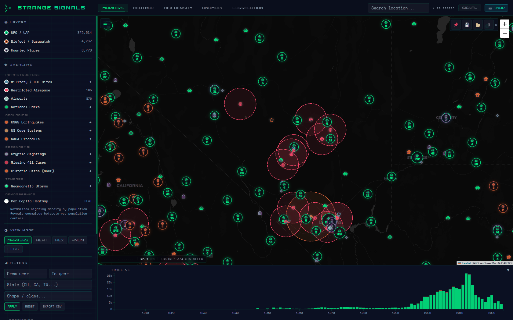

The Nevada Test and Training Range with military sites, restricted airspace rings and airports
enabled &mdash; the confounder stack you have to rule out before claiming anything.

### Correlation Matrix
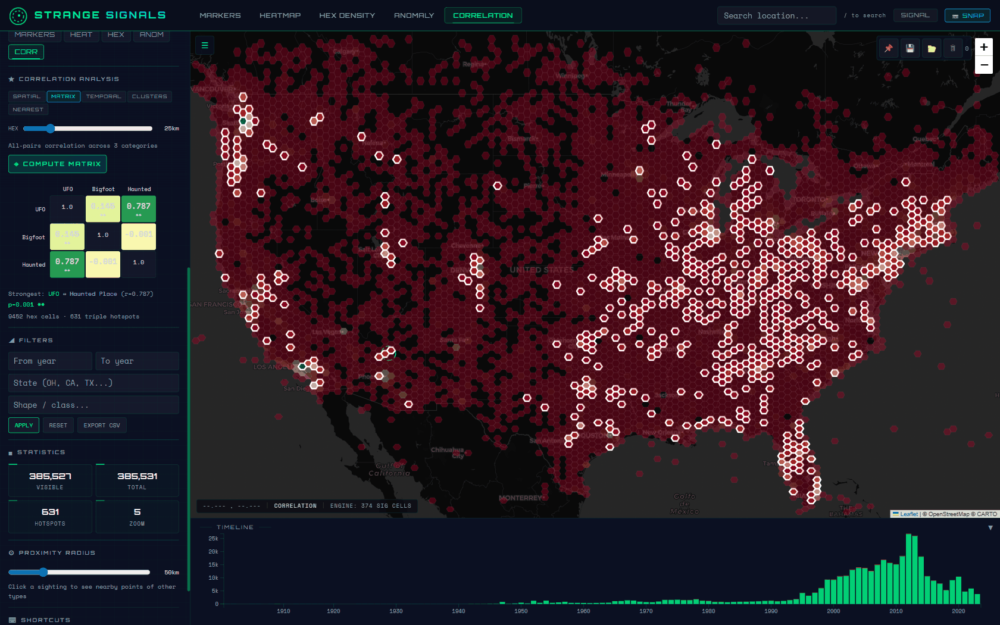

All-pairs correlation across 9,452 hex cells. UFO&harr;Haunted r=0.787 (p&lt;0.001), while
Bigfoot&harr;Haunted is a flat &minus;0.001. 631 triple hotspots.

### Temporal Correlation Dashboard
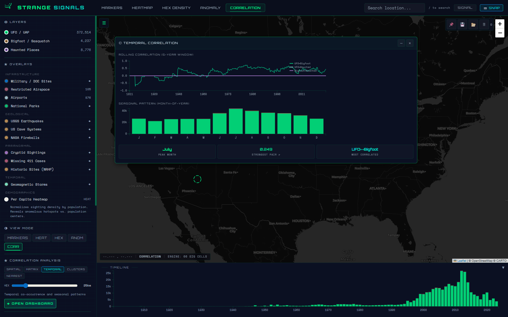

### SIGNAL Analyst
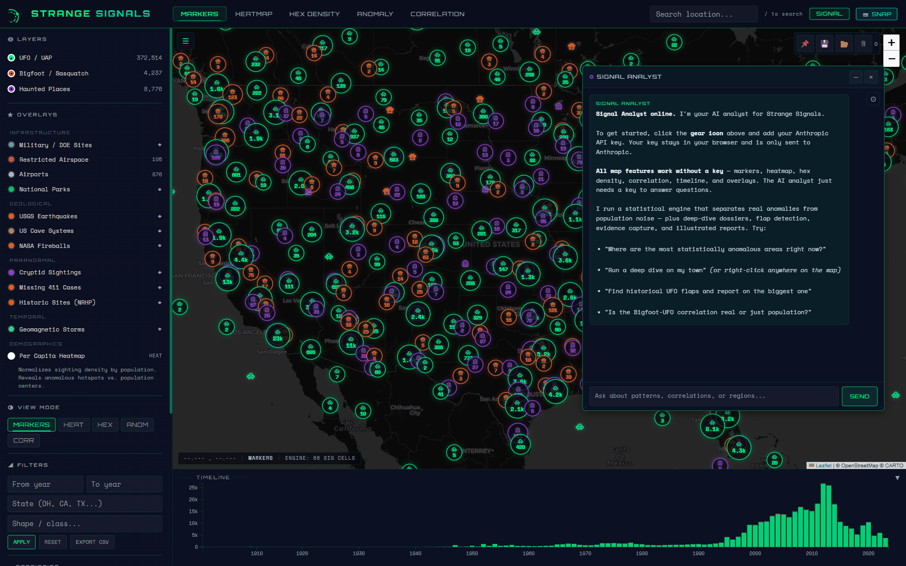

## Getting Started

### Prerequisites

- Python 3.8+ (for the data pipeline)
- A modern web browser
- (Optional) An [Anthropic API key](https://console.anthropic.com/) for SIGNAL AI

### Quick Start

```bash
# Clone the repo
git clone https://github.com/Samizdat-Publications/strange-signals.git
cd strange-signals

# Install Python dependencies
pip install -r requirements.txt

# Run the data pipeline (downloads datasets, builds JSON)
bash setup_sightings.sh

# Start the dev server
python -m http.server 8001

# Open http://localhost:8001 in your browser
```

### SIGNAL AI Setup

All map features work without an API key. To enable the AI assistant:

1. Click the **SIGNAL** button in the top-right
2. Click the gear icon in the SIGNAL panel
3. Enter your Anthropic API key
4. Your key stays in your browser's localStorage — it is never sent anywhere except directly to Anthropic's API

## Data Sources

### Sighting Datasets (385,531 records)

Totals after dedup and geocoding: **UFO/UAP 372,518 &bull; Bigfoot 4,237 &bull; Haunted Places 8,776**.

| Dataset | Records | Source |
|---------|---------|--------|
| UFO/UAP (NUFORC via HuggingFace, geocoded) | ~109K | [geocode_nuforc_hf.py](geocode_nuforc_hf.py) — city-level gazetteer geocoding, worldwide |
| UFO/UAP (NUFORC via TidyTuesday) | ~96K | [TidyTuesday 2023](https://github.com/rfordatascience/tidytuesday/tree/master/data/2023/2023-06-20) |
| UFO/UAP (planetsig geocoded) | ~80K | [planetsig/ufo-reports](https://github.com/planetsig/ufo-reports) |
| UFO/UAP (Larry Hatch \*U\* database) | ~18K | [RR0/uDb](https://github.com/RR0/uDb) — the historical catalog, 593 BC onward |
| Bigfoot (BFRO detailed) | ~5K | [TidyTuesday 2022](https://github.com/rfordatascience/tidytuesday/tree/master/data/2022/2022-09-13) |
| Bigfoot (BFRO locations) | ~4.2K | [Christopher1994-1/bigfoot-dataset-website](https://github.com/Christopher1994-1/bigfoot-dataset-website) |
| Haunted Places (Shadowlands) | ~11K | [TidyTuesday 2023](https://github.com/rfordatascience/tidytuesday/tree/master/data/2023/2023-10-10) |

### Overlay Datasets

| Dataset | Records | Description |
|---------|---------|-------------|
| Military / DOE Sites | 98 | Major military installations and DOE facilities |
| Restricted Airspace | 105 | MOAs, prohibited zones, restricted areas with altitude data |
| Airports | 876 | US large + medium airports (OurAirports) — the strongest UAP confounder |
| USGS Earthquakes | 20,000 | US M2.5+ earthquakes 2019–2025 with magnitude and depth |
| US Cave Systems | 104 | Notable cave systems with type and length |
| NASA Fireballs | 877 | CNEOS located bolides, global 1988–present, with impact energy |
| Cryptid Sightings | 105 | Non-Bigfoot cryptid reports (Mothman, Chupacabra, etc.) |
| Missing 411 | 71 | Unexplained disappearances in wilderness areas |
| Geomagnetic Storms | 92 | G3+ geomagnetic storms (temporal overlay on timeline) |
| National Parks | 30 | Park boundaries |
| Historic Sites (NRHP) | 30 | National Register of Historic Places entries |
| Per Capita Grid | — | US census tract population density, for population-corrected views |

## Architecture

Strange Signals is a **zero-build static web app** — no webpack, no npm, no bundlers. Just HTML, CSS, and JavaScript served from a simple HTTP server.

### Tech Stack

| Technology | Version | Purpose |
|------------|---------|---------|
| [Leaflet](https://leafletjs.com/) | 1.9.4 | Map rendering, markers, popups |
| [Leaflet MarkerCluster](https://github.com/Leaflet/Leaflet.markercluster) | 1.5.3 | Dynamic cluster visualization |
| [leaflet-heat](https://github.com/Leaflet/Leaflet.heat) | 0.2.0 | Heatmap overlay |
| [Turf.js](https://turfjs.org/) | 7.3.5 | Geospatial analysis (hex grid, point-in-polygon, distances) |
| [D3.js](https://d3js.org/) | 7.9.0 | Timeline, correlation charts, SVG rendering |
| [html2canvas](https://html2canvas.hertzen.com/) | 1.4.1 | PNG snapshot export and AI map captures |
| [CARTO Dark Matter](https://carto.com/basemaps/) | — | Dark map tiles |

### File Structure

```
index.html                 HTML shell — structure, CDN refs, links CSS/JS
strange-signals.css        All styles — CSS custom properties, layout, responsive
strange-signals.js         Main app logic (~2800 lines) — IIFE-wrapped
ai-assistant.js            SIGNAL AI assistant — tool-use Claude integration
signal-reports.js          Report generation and HTML export
signal-charts.js           SVG chart rendering for reports

data/
  sightings_ufo.json.gz       UFO/UAP sightings (~14 MB gzipped; committed)
  sightings_bigfoot.json.gz   Bigfoot/Sasquatch sightings (~150 KB; committed)
  sightings_haunted.json.gz   Haunted Place records (~300 KB; committed)
  military_bases.json      Military/DOE installations
  restricted_airspace.json Restricted airspace zones
  usgs_earthquakes.json    USGS earthquake data
  us_caves.json            US cave systems
  nasa_fireballs.json      NASA fireball events
  cryptid_sightings.json   Non-Bigfoot cryptid reports
  missing411.json          Missing 411 cases
  geomagnetic_storms.json  Solar storm temporal data
  us_population_density.json  Population density grid
  national_parks.json      National park boundaries

setup_sightings.sh              Download raw datasets
build_sightings_workbook.py     Consolidate CSVs to Excel
export_map_data.py              Excel to compact JSON
build_overlay_data.py           Generate overlay datasets
build_population_grid.py        Population density grid
```

### Data Format

Sighting records use a compact array format (not objects) to minimize JSON size:

```json
{
  "categories": ["UFO/UAP", "Bigfoot/Sasquatch", "Haunted Place"],
  "fields": ["lat", "lon", "cat", "date", "location", "subcategory", "description"],
  "data": [[39.12, -84.56, 0, "2020-01-15", "Cincinnati, OH", "triangle", "Bright light..."]]
}
```

## SIGNAL AI

SIGNAL is an AI research assistant built directly into Strange Signals. It uses Claude's tool-use capability to interact with the map programmatically.

### Available Tools

| Tool | Description |
|------|-------------|
| `search_sightings` | Search by location, date range, category, or description keywords |
| `get_area_stats` | Statistical summary for the current map viewport |
| `run_spatial_correlation` | Pearson correlation between any two categories or overlays |
| `detect_clusters` | BFS-based hotspot detection with configurable thresholds |
| `filter_data` | Apply year, state, or subcategory filters |
| `navigate_map` | Pan/zoom to specific locations or coordinates |
| `toggle_overlay` | Enable/disable overlay layers |
| `get_nearby_overlays` | Find overlay features within a radius of a point |
| `generate_report` | Create downloadable HTML investigation reports |
| `render_chart` | Generate SVG charts (bar, line, scatter) in the chat |

### Example Prompts

- *"Show me UFO hotspots in the Pacific Northwest"*
- *"Are Bigfoot sightings correlated with cave systems?"*
- *"What happened near Area 51 between 2010 and 2020?"*
- *"Run a full correlation analysis and generate a report"*
- *"Compare sighting density near military bases vs. elsewhere"*

## Keyboard Shortcuts

| Key | Action |
|-----|--------|
| `1` `2` `3` | Toggle UFO / Bigfoot / Haunted layers |
| `M` `H` `X` `N` `C` | Switch view mode (Markers / Heat / Hex / Anomaly / Correlation) |
| `I` | Open SIGNAL AI assistant |
| `A` | Enter annotation mode |
| `S` | Toggle sidebar |
| `T` | Toggle timeline |
| `F` | Fullscreen map (collapse sidebar + timeline) |
| `R` | Reset map to US center |
| `P` | Export PNG snapshot |
| `/` | Focus search bar |
| `?` | Show all shortcuts |
| `Esc` | Close windows, else reset filters |

## Deployment

The app is a static site with no build step, so any static host works. It is deployed to
**Cloudflare Pages** straight from this repo:

| Setting | Value |
|---------|-------|
| Framework preset | None |
| Build command | *(empty)* |
| Build output directory | `/` |

[`_headers`](_headers) at the repo root supplies the caching and security headers Pages
applies at the edge — notably `no-cache` on `sw.js` (a cached Service Worker would pin
users to a stale `CACHE_VERSION`) and a long `stale-while-revalidate` window on `/data/*`.
The Content-Security-Policy travels in a `<meta>` tag in `index.html` instead, so it holds
on any host including a bare `python -m http.server`.

Two constraints worth knowing before you fork:

- `data/sightings_ufo.json.gz` is **14.5 MB**, comfortably under the Cloudflare Pages
  25 MiB per-file cap — but re-running the pipeline with more sources could push past it.
  Split the file further (see `export_map_data.py`) if that happens.
- No API keys or secrets are needed at deploy time. The SIGNAL AI assistant asks each
  visitor for their own Anthropic key and keeps it in their browser's `localStorage`.

## Contributing

Contributions are welcome! See [CONTRIBUTING.md](CONTRIBUTING.md) for guidelines.

### Areas for Contribution

- Additional overlay datasets (seismic fault lines, ley lines, water sources)
- International sighting data (currently US-only)
- Mobile-optimized layout improvements
- Additional correlation analysis methods
- Data pipeline improvements

## License

This project is licensed under the MIT License — see [LICENSE](LICENSE) for details.

## Acknowledgments

- [NUFORC](https://nuforc.org/) — National UFO Reporting Center for decades of sighting data
- [BFRO](https://www.bfro.net/) — Bigfoot Field Researchers Organization
- [TidyTuesday](https://github.com/rfordatascience/tidytuesday) — For curating and sharing datasets
- [Shadowlands Haunted Places](http://www.theshadowlands.net/) — Haunted location database
- [USGS](https://earthquake.usgs.gov/) — Earthquake data
- [NASA CNEOS](https://cneos.jpl.nasa.gov/) — Fireball and bolide data
- [Anthropic](https://anthropic.com/) — Claude AI powering SIGNAL

---

<p align="center">
  <em>Built with curiosity. Explore the unknown.</em>
</p>
